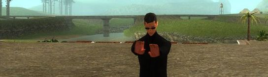

# woozie
A primitive for powerful routing/matching/resolving.

> **Carl**: "*Uh, one last thing. You do know that I'm black, right? And not Chinese.*"\
> **Woozie**: "*I'm blind, Carl, not stupid.*"

## What is woozie?
`woozie` is a NPM module. It implements the routing primitives.
The goal of `woozie` is to provide simple declarative routing for modern JavaScript applications.

## License
Licensed under [MIT license](LICENSE).

## Etymology
From [GTA Wiki](http://gta.wikia.com/wiki/Wu_Zi_Mu):
> **Wu Zi Mu** (Chinese: 吴梓穆, Pinyin: wú zì mù, known to his friends as "**Woozie**") is a character in the [Grand Theft Auto](http://gta.wikia.com/wiki/Grand_Theft_Auto) series who appears as a main character in [Grand Theft Auto: San Andreas](http://gta.wikia.com/wiki/Grand_Theft_Auto:_San_Andreas).
